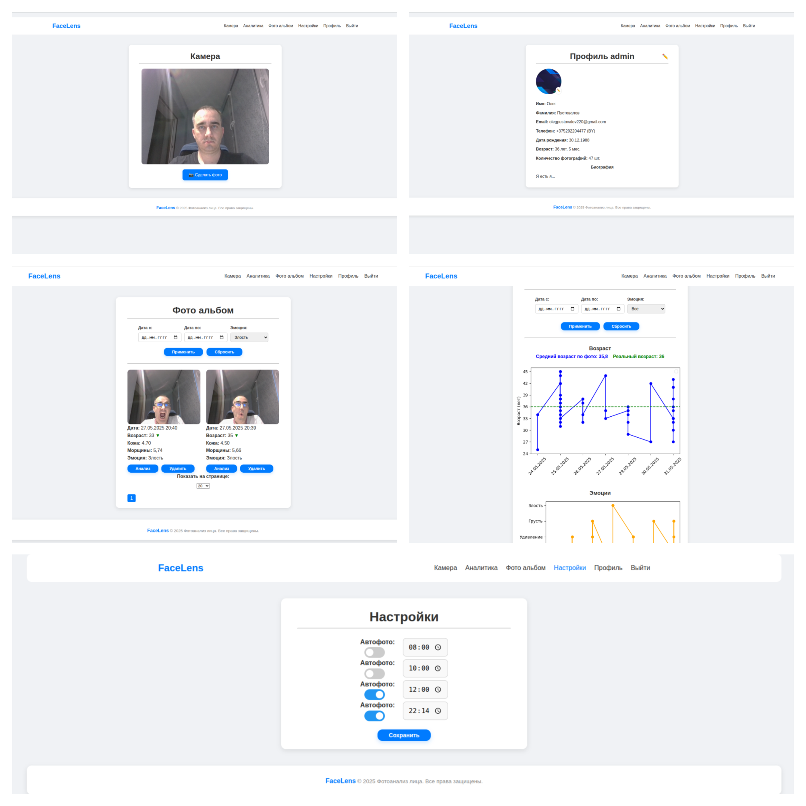

# Фотоанализ лица

**Описание проекта:**  
Это удобное и инновационное веб-приложение на базе Django, позволяющее быстро и точно определить возраст человека, оценить состояние кожи и выявить эмоциональное состояние на основе загруженных фотографий.

---

## Основные возможности

- Определение среднего возраста по фотографии лица.
- Сравнение среднего возраста с реальным возрастом пользователя.
- Анализ эмоционального состояния на фото.
- Интерактивные графики и визуализация результатов.
- Фильтрация и анализ данных по дате и эмоциям.

---

## Команды

- Файл для выполнения команд [setup.sh](setup.sh)

